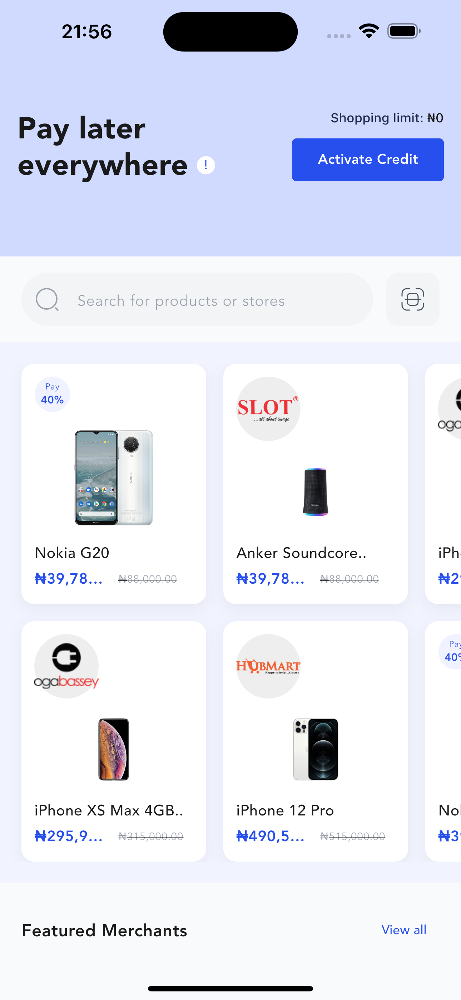
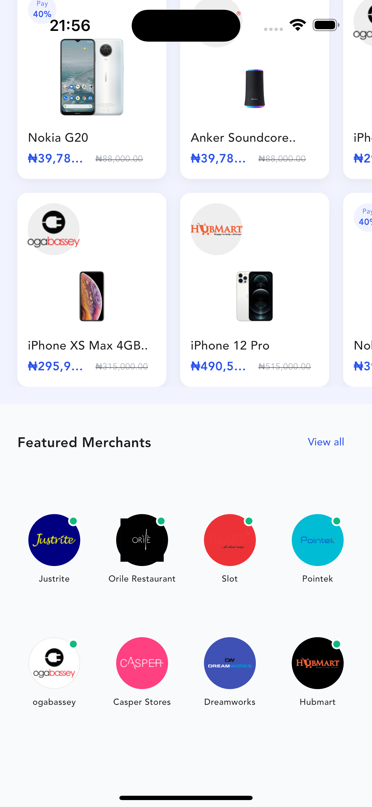

# CredPal App Assessment

A Flutter application implementing the "Pay later everywhere" home screen for CredPal, featuring a responsive UI, custom widgets, and dynamic layouts.





## Features

*   **Responsive UI**: The layout adapts to different screen sizes, ensuring optimal visibility of product cards (2.1 columns visible).
*   **Custom Fonts**: Uses the **'Avenir'** font family globally for a consistent and premium look.
*   **SliverAppBar**: Implements a floating app bar with a custom background color (`#D0DAFF`) that hides/shows on scroll.
*   **Horizontal Product Grid**: A custom-built, horizontally scrolling grid displaying products in 2 rows.
*   **Search Bar**: Includes a custom search input with SVG icons for search and scanning.
*   **Featured Merchants**: A section displaying merchant logos in a grid.

## Project Structure

The project follows a clean architecture approach, organized within `lib/presentation`:

*   `screens/`: Contains the main screen definitions (e.g., `HomeScreen`).
*   `widgets/`: Reusable UI components:
    *   `HomeHeader`: The top section with the title and activation button.
    *   `CustomSearchBar`: The search input field.
    *   `ProductGrid`: The scrolling grid of products.
    *   `MerchantSection`: The list of featured merchants.
*   `app.dart`: Main app configuration and theme setup.

## Getting Started

### Prerequisites

*   Flutter SDK (Latest stable version recommended)
*   Dart SDK

### Installation

1.  **Clone the repository:**
    ```bash
    git clone <repository-url>
    ```
2.  **Navigate to the project directory:**
    ```bash
    cd credpal_app
    ```
3.  **Install dependencies:**
    ```bash
    flutter pub get
    ```
4.  **Run the application:**
    ```bash
    flutter run
    ```

## Development Notes

*   **Assets**: Images and SVGs are stored in `assets/images` and `assets/svgs` respectively. Ensure these folders exist and are populated.
*   **Fonts**: The 'Avenir' font is configured in `pubspec.yaml` (ensure the font files are present in `assets/fonts/` if not using a system font fallback).
*   **Dependencies**:
    *   `intl`: For currency formatting.
    *   `flutter_svg`: For rendering SVG icons.
    *   `google_fonts`: (Originally used, now replaced by global styles, but dependency remains in pubspec).

## Verification

The UI has been verified to match the design specifications, including:
*   Correct layout and spacing.
*   Accurate colors and typography.
*   Smooth scrolling behaviors.
*   Responsive card sizing.
